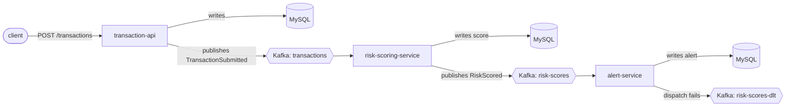

# risk-signal-platform

[](https://github.com/sahilkalgutkar/risk-signal-platform/actions/workflows/ci.yml)
[](https://codecov.io/gh/sahilkalgutkar/risk-signal-platform)
[](codecov.yml)
[](LICENSE)

I built this as an event-driven transaction risk-scoring platform on the stack I actually use at
work day to day — Java, Spring Boot, and Kafka — which my other portfolio projects (Go, Node,
Python) don't touch. Three Spring Boot services talk to each other only through Kafka, backed by
MySQL, with a full local observability stack (Prometheus + Grafana for metrics, the ELK stack for
logs) wired up and actually working, not just declared in a compose file.

## Architecture



- **transaction-api** — REST API (`POST /transactions`, `GET /transactions/{id}`). Persists to
  MySQL via Flyway-migrated JPA entities, then publishes a `TransactionSubmitted` event.
- **risk-scoring-service** — consumes `transactions`, runs the transaction through a small set of
  independent, Spring-collected `RiskRule` beans (amount threshold, merchant/account country
  mismatch, watchlisted merchant country), sums the triggered scores into a 0-100 risk score and
  level, persists it, and publishes `RiskScored`.
- **alert-service** — consumes `risk-scores`, and for anything at or above the configured
  threshold, persists an alert and dispatches a notification (logged, standing in for a real
  PagerDuty/Slack integration). A failed dispatch retries on Kafka-native retry topics with
  backoff before landing on a dead-letter topic instead of blocking the partition or silently
  dropping the alert.

Each service is idempotent per `transactionId` — a redelivered event (consumer rebalance, retry)
finds the row already there and is a no-op rather than double-scoring or double-alerting.

## Why these choices (talking points)

- **Kafka-native retry, not `@Retryable`** — `alert-service`'s notification dispatch failures are
  handled with `@RetryableTopic` (`RiskScoredListener`), which republishes to dedicated
  `risk-scores-retry-0`, `-1`, ... topics with backoff instead of blocking the consumer thread or
  looping in-process. After exhausting retries, the event lands on `risk-scores-dlt` and a
  `@DltHandler` logs it rather than dropping it silently — verified in `AlertServiceIT` by forcing
  the notification dispatcher to always throw and asserting the event actually reaches the DLT
  topic.
- **Durable write, best-effort publish, tracked** — all three services follow the same shape:
  persist to MySQL first (that's the durable fact), then publish to Kafka. If the publish fails,
  the row stays with `event_published=false` instead of failing the request/consumer — a
  reconciliation sweep of `event_published=false` rows (not implemented here, called out as a
  known gap below) would be the production-grade way to close that window.
- **Rules as Spring beans, not a switch statement** — `RiskRule` is an interface; `RiskEngine`
  just takes `List<RiskRule>` and Spring autowires every `@Component` that implements it. Adding a
  rule means adding a class, not touching the engine or any existing rule's tests.
- **A real custom Micrometer metric, not just JVM defaults** — `risk_scores_total{level=...}` is
  incremented once per scored transaction and is what the Grafana dashboard's main panel actually
  graphs (transactions scored per minute, by risk level), alongside the generic HTTP/JVM panels
  every Spring Boot app gets for free.
- **Structured JSON logs, shipped, not just printed** — `logback-spring.xml` in each service
  switches to `LogstashEncoder` under the `docker` Spring profile, and Filebeat's Docker
  autodiscovery ships any container labeled `risksignal.logs: json` straight to Elasticsearch —
  see `docker-compose.yml` and `infra/filebeat/filebeat.yml`.
- **Surefire vs. Failsafe, deliberately** — `*Test` classes (fast, mocked) run under `mvn test`;
  `*IT` classes (real MySQL + Kafka via Testcontainers) run under `mvn verify`. That split means a
  normal edit-test loop never needs Docker, while CI still gets full Testcontainers coverage.

## Local development

Requires JDK 21 and Docker.

```bash
./mvnw test          # fast unit + web-slice tests, no Docker required
./mvnw verify         # adds the *IT Testcontainers suite (spins up real MySQL + Kafka)
```

To run the whole platform, including Kafka, MySQL, Prometheus/Grafana, and the ELK stack:

```bash
docker compose up --build
```

| Service                                | URL                          |
|-----------------------------------------|-------------------------------|
| transaction-api                         | http://localhost:8081         |
| risk-scoring-service actuator           | http://localhost:8082/actuator |
| alert-service actuator                  | http://localhost:8083/actuator |
| Grafana (dashboard auto-provisioned)    | http://localhost:3000         |
| Prometheus                              | http://localhost:9090         |
| Kibana                                  | http://localhost:5601         |

Grafana is set to anonymous admin access locally (`GF_AUTH_ANONYMOUS_ENABLED`
in `docker-compose.yml`) — no login needed, you land straight on the
provisioned dashboard.

Try the whole event chain end to end:

```bash
curl -X POST http://localhost:8081/transactions \
  -H "Content-Type: application/json" \
  -d '{"accountId":"acct-1","amount":5000.00,"currency":"USD","merchantCountry":"KP","accountCountry":"US"}'
```

That transaction trips all three risk rules (large amount, country mismatch, watchlisted merchant
country), scores 100/HIGH, and shows up as an alert within a few seconds — watch it happen in
`docker compose logs -f risk-scoring-service alert-service`, or in Grafana's "transactions scored
per minute, by risk level" panel.

## Kubernetes

`infra/k8s/` has Kustomize manifests for a local `kind` cluster or EKS — see
[infra/k8s/README.md](infra/k8s/README.md) for the full walkthrough and the AWS path (RDS for
MySQL, MSK for Kafka, OpenSearch for the ELK stack).

## Known simplifications (called out deliberately, not accidental)

- **No reconciliation job** for rows left with `event_published=false` after a Kafka outage — the
  column exists specifically so one could be added; see "durable write, best-effort publish" above.
- **Risk rules are deliberately simple and stateless** — no velocity/frequency rules, which would
  need a lookback query or a stream-processing window rather than a pure function over one event.
  Easy to add as another `RiskRule` bean; left out to keep the demo's scope honest.
- **Single-broker Kafka, single-instance MySQL** everywhere (compose and the local-kind k8s path)
  — fine for a demo, not how either would be run in production. The EKS path in `infra/k8s/`
  documents swapping both for managed services (MSK, RDS).
- **`docker-compose-smoke-test`'s CI job only exercises the happy path** (submit a transaction,
  confirm it's stored) — it doesn't wait for the async risk-scoring/alerting chain to finish, since
  polling Kafka consumer lag from a shell script gets fragile fast. `AlertServiceIT` is the real
  end-to-end proof of the full chain, including the retry/DLT path.

## License

[MIT](LICENSE)
